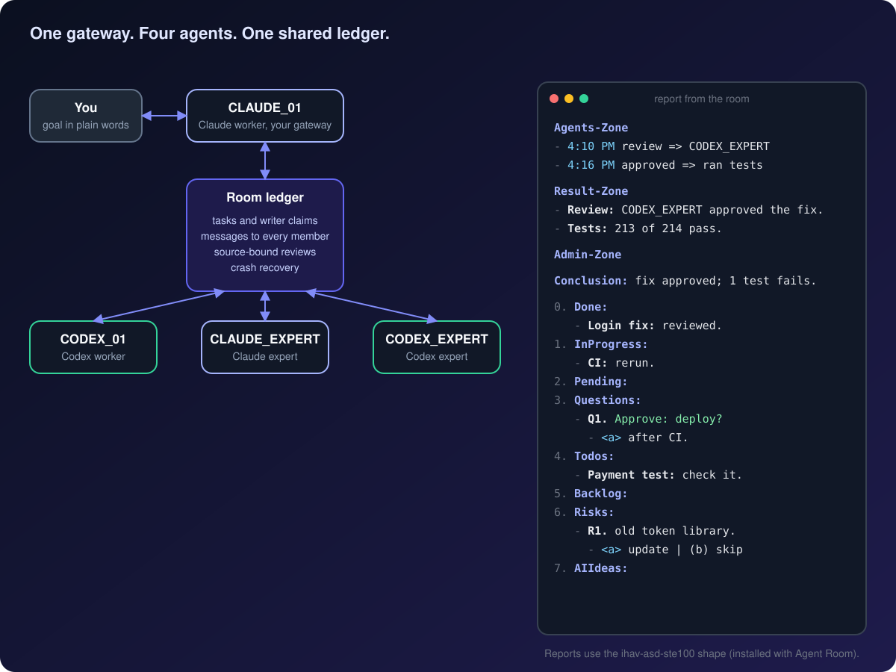

<h1 align="center">Agent Room</h1>

<p align="center">
  <strong>A small team of Claude Code and Codex agents that works in your project like colleagues.</strong><br>
  Shared tasks. Peer review across model families. Recovery after a crash. One readable report to you.
</p>

<p align="center">
  <a href="LICENSE"></a>
  
  
  
  <a href="https://github.com/hiendang7613/ihav-asd-ste100"></a>
</p>

<p align="center">
  
</p>

<p align="center">
  <a href="#install">Install</a> ·
  <a href="#start">Start a room</a> ·
  <a href="#reports">Readable reports</a> ·
  <a href="#how">How it works</a> ·
  <a href="#status">Honest status</a>
</p>

You describe the goal in plain words. A Claude Code and Codex pair plans, writes, reviews and recovers together.
The optional advisors mode adds two experts.
One of them, the gateway, talks to you; the others reach you through it.
Every task, message and review lives in a local ledger, so nothing is lost when a session dies.

## Why a room, not one agent

- **Two model families check each other.** A Claude change can get a Codex review, and the other way round.
- **Nothing is lost when a session dies.** Tasks, messages, claims and reviews live in a local SQLite ledger; members resume their native sessions where they stopped.
- **Every member hears every message.** Copies are marked FYI, so only the addressed member owns a request or a task.
- **Writers do not collide.** One writer per file scope, claimed through the CLI before editing.
- **Reviews are tied to the source.** A review receipt names the exact submission and source digest it approves.
- **Agents talk like colleagues.** Members ask, challenge, remind and help each other without a fixed script.

<a name="install"></a>

## Install

Requirements: macOS, Python 3.11 or later, Claude Code with background sessions, and Codex with the app server.
Log in to each product with its own CLI first; Agent Room keeps native permissions and credentials untouched.

```bash
# Claude Code
claude plugin marketplace add hiendang7613/ihav-agent-room
claude plugin install ihav-agent-room@ihav-agent-room-marketplace

# Codex
codex plugin marketplace add hiendang7613/ihav-agent-room
codex plugin add ihav-agent-room@ihav-agent-room-marketplace
```

Installing Agent Room in Claude Code also installs [ihav-asd-ste100](https://github.com/hiendang7613/ihav-asd-ste100), which shapes the reports you read.
Restart Claude Code afterwards.

<a name="start"></a>

## Start a room

This checkout contains **version 0.8.9**. Marketplace installation uses the latest published
release, which can be older than this checkout.

Open your project in Codex and use the single entry command:

```text
$ihav-agent-room:start
```

New rooms start in **pair** mode with 2 members: **CLAUDE_WORKER** (CLAUDE_01) and **CODEX_WORKER** (CODEX_01).
The existing session that starts the room is its gateway: CLAUDE_01 in Claude Code, CODEX_01 in Codex.
In Claude Code, use `/ihav-agent-room:start`. The same command creates a new room,
resumes a stopped room, or connects to an already running room without duplicate workers.
When an exact pair worker has exited but its controller remains live, explicit start
requests owned cleanup and resumes the saved worker. Live or unverifiable workers,
identity mismatches and pending approvals remain blocked; global notices never trigger recovery.
The supervisor joins `~/.ihav/agents_space/` automatically; no separate global join is needed.
An explicit room audience queues a global notice only for that room; `all` reaches joined rooms,
excluding the sender's echo. Notices enter each receiving gateway's local queue even when its room
is stopped. They never start a room or change its owner, mode, saved sessions or `manual_stop`.
An already running supervisor imports pending notices and dispatches its normal queue. A stopped
room keeps them until its normal start. Stable entry IDs prevent duplicate queueing; imports
do not fan out to local workers or create tasks, admin receipts or permissions. Failed queue
imports are reported separately from the committed global entry; do not repost the announcement.
The first upgraded client establishes the queue's starting point. Older entries remain readable
in the global ledger without replaying into local queues. Global read markers do not acknowledge
local queue delivery, so reading an announcement cannot skip recovery after a failed queue import.
The other member runs in the background. Codex-hosted rooms require the local native
Unix WebSocket control socket and the experimental queue API. The WebSocket SDK is
bundled with the plugin, so start does not require a separate pip install.
Run `/ihav-agent-room:mode advisors` for the four-member room, which adds **CLAUDE_EXPERT** and **CODEX_EXPERT**. Start output says the same.
For a new room, start creates `agents_space/` and adds managed blocks to `AGENTS.md`, `CLAUDE.md` and `.gitignore`; your own content stays.
Existing rooms keep their project files. The plugin exposes six skills: `start`, `status`, `stop`, `mode`, `effort` and `doctor`.
The former `init`, `init-agents-space` and `connect` skills have been removed; use `start` for normal setup and recovery.
The CLI still provides `ihav-agent-room init --no-start` for scaffold maintenance and `ihav-agent-room connect --check` for read-only diagnosis.

Then keep talking to your gateway in plain words:

> Find why uploads fail, fix it in the current scope, ask a teammate to review, then report back.

> Can the two of you find a simpler approach? Discuss it and propose one.

> Continue the assigned work. If you learn something worth keeping, record and share it.

You never write JSON, look up record IDs or route messages. The gateway handles tasks, scope, claims, inbox, reviews and knowledge.

### Connect an existing room from Codex

Open the same project in Codex and invoke `$ihav-agent-room:start`. Start checks the room first,
preserves its mode, tasks, decisions and history, and transfers only a stopped, reconciled room.
It does not terminate the old Claude host. Existing tasks, file claims and native approvals must be
reconciled before a host transfer. Other project rooms stay unchanged.
When returning to Claude Code, `/ihav-agent-room:start` performs the same safe transfer.
The room remembers host conversations separately from background worker sessions,
so a host conversation is never resumed as a competing background worker.
The first Codex connection marks this room as schema 4 without changing ledger tables. Older runtimes
refuse to operate that room, so their Claude-only hooks cannot silently take ownership back. Schema 3
Claude rooms remain supported. Returning to an older plugin requires a separately reconciled migration;
changing the schema number by hand is not a recovery procedure.

**Use only `$ihav-agent-room:start` for ordinary Codex recovery.** If a stopped Codex-hosted room
belongs to a previous conversation, start verifies both exact conversations through the native host.
Only a confirmed `notLoaded` former conversation permits reattachment to the current conversation.
The previous ID stays in `room.host_session_history`, with a SQLite backup. Start also returns
`working_context`: bounded final replies from this room's exact former gateways, source timestamps,
and open-note pointers. The start skill uses them to recover project goals, unanswered decisions,
next actions and backlog, reconciling each with current task/note state and Git. An empty active-task
list does not mean the project is complete. Historical replies grant no approval, and old progress
estimates stay historical. Source-linked closing sections are saved locally; full private native
conversations remain in their native sessions and are not broadcast. The diagnostic
`ihav-agent-room --json context` refreshes the same read-only packet; missing or truncated sources
are reported explicitly. Missing-source updates retain the old comparison baseline, so reconnect
does not hide task or checkout changes since the saved closing. Native identity errors remain
blocked even during startup. The old native private conversation is not copied or resumed.
An attached or unverifiable former conversation, live workers or native approvals block reattachment.
The diagnostic CLI `connect` and maintenance CLI `init` retain their exact saved-session requirement.
The plugin never starts a competing native controller or changes permissions to force recovery.

### Recover project context after exit

Explicit start can also recover an exact saved Claude worker whose native registry reports a completed background job without a PID. It requires the matching project, an inactive terminal state and confirmed ledger process absence. Ambiguous identity, liveness and approvals remain held.

The local candidate saves source-linked Admin-Zone sections in the room SQLite ledger at the
gateway's Stop hook. Explicit start also imports verified former gateway closing sections for
older rooms. A later short connection reply cannot erase project goals. Empty Pending or Quests
sections retain prior work for reconciliation; they do not prove it was resolved.
If the ordinary 2 MiB tail has no complete project closing, bootstrap searches at most 8 MiB
of that exact source. Missing or cut closing sources remain explicit gaps, even when another
gateway's older sections were recovered.

Start returns `working_context.project_state` with historical goals, waiting choices, risks,
backlog, source/timestamp, current ledger drift and a bounded checkout comparison. The skill
reads cut sections through `context --full` internally and rebuilds the project's Admin-Zone.
Older source-linked sections live in a separate private archive, so hundreds of closing updates
do not fill the current snapshot. The initial response includes four prior sections; the skill
reads further pages internally, using `context --prior-after N --prior-limit 20` and `--full`
only when needed. Exact archived wording survives removal of the native transcript. The snapshot
keeps its schema-1 format so the retained rollback release can still read the latest sections.
Rollback-era inline history remains visible after rolling forward, even without a new capture.
Each page reports which history was checked; unvisited pages remain unverified. Retained section
flags mean history needs reconciliation, not that a resolved task or decision becomes pending again.
The current snapshot has an 8 MiB limit; capacity refusal preserves the last saved state.
Git HEAD/path-status equality does not validate dirty file contents, old tests, login or provider state.
Missing, corrupt or oversized closing state stays an explicit recovery gap.

Controller connection and `team_readiness` are separate. A stopped or mismatched worker cannot
produce a ready-pair claim. After native proof that the former Codex controller closed, start
waits briefly for owned shutdown without forcing a turn or answering an approval.
This local implementation still needs both-host native resume/reconnect/handoff evidence before
complete automatic recovery is claimed. Historical choices never grant new execution authority.

For direct local diagnosis:

```sh
ihav-agent-room --json connect --check       # Read-only plan from any shell; no workers or prompts.
ihav-agent-room --json doctor --gateway      # Read-only native Codex thread/queue capability probe.
ihav-agent-room --json start                # Setup, safe handoff, resume and global registration.
```

The check also works in an ordinary terminal. Outside the intended Codex host it
returns `codex_host_required: true`, `current_codex_session: null` and the exact
command to open the saved session; `can_connect` stays false. The actual `connect`
command must run through tools in that Codex session, not directly from a shell.

Codex hooks have their own configuration in `hooks/codex.json`. Review and trust them in Codex before
expecting automatic receipts or resume; installation alone does not trust hooks. Hosts with cloud
orchestration are outside this local integration. Prompt provenance remains strict: a Codex rollout row
without an explicit human origin is unverified, and cannot authorize implementation assignments or native
approvals. Automated room messages and inputs with client message IDs cannot become human receipts.
This limitation is visible rather than bypassed. The transcript adapter is version-sensitive.

| Command | What it does |
|---|---|
| `/ihav-agent-room:start` (Claude) / `$ihav-agent-room:start` (Codex) | Creates, reconnects or resumes the room; new rooms use pair mode. |
| `/ihav-agent-room:mode` | Shows the mode, or switches between `pair` (2 members) and `advisors` (4 members) now. |
| `/ihav-agent-room:effort` | Shows or sets member effort; when you change your own `/effort`, every member follows (the first level seen is only the starting point). |
| `/ihav-agent-room:status` | Shows members, tasks, queues and delivery gaps. Read-only. |
| `/ihav-agent-room:stop` | Stops the room and keeps unfinished work. |
| `/ihav-agent-room:doctor` | Checks the installation and the room. Read-only. |

<a name="reports"></a>

## Readable reports

Agent Room installs [ihav-asd-ste100](https://github.com/hiendang7613/ihav-asd-ste100), so every report from the room has the same shape:
three labelled zones: the agent's timed steps, key-first bullets, then a one-sentence conclusion and eight fixed sections. A report looks like this:

**Agents-Zone**
- `4:10 PM` the fix needs a cross-family review => sent it to CODEX_EXPERT
- `4:16 PM` the review came back approved => ran `npm test`

**Result-Zone**
- **Review:** CODEX_EXPERT approved the login fix after reading the diff.
- **Tests:** `npm test` ran 214 tests; 213 pass.

**Admin-Zone**

**Conclusion:** The login fix is approved; one payment test still fails, cause not checked.

0. **Done:**
   - **Login fix:** reviewed and merged.
1. **InProgress:**
   - **CI:** reruns the full suite.
2. **Pending:**
3. **Questions:**
   - **Q1.** Approve: deploy the fix to production?
     - `<a>` After CI passes.
     - (b) Now.
4. **Todos:**
   - **Payment test:** CODEX_01 checks `payment.spec.ts:88`.
5. **Backlog:**
6. **Risks:**
   - **R1.** `jsonwebtoken` 8.5.1 is older than the 9.0.0 security release.
     - `<a>` update it in a separate change | (b) skip | (c) later
7. **AIIdeas:**
   - **I1.** Add a test for the `Authorization` header.
     - `<a>` plan it | (b) skip | (c) later

It works in any language. Say `stop ste mode` to pause it for a session.

<a name="how"></a>

## How it works

| Part | What it does |
|---|---|
| Supervisor | Starts members, delivers messages, and recovers the room after a crash |
| Ledger | A local SQLite store of tasks, claims, messages, submissions, reviews and knowledge |
| `ihav-agent-room` CLI | Tasks, claims, inbox, send, review, status and guides, used by the agents |
| Hooks | Bring room context into each native Claude Code turn |
| Codex bridge | Runs the Codex members through `codex app-server` |

- **Delivery:** every room message is queued for the other members and sent as soon as the queue runs. Messages wait while the room or a member is stopped. `ihav-agent-room wakes` separates queued, attempted and acknowledged deliveries; none of these numbers proves an agent has read a message.
- **Models:** the roster requests Sonnet 5.5, Luna 6, Opus 5.5 and Sol 6.1 at `xhigh` effort. CLAUDE_01 is your own session, so the room does not change its model. `ihav-agent-room status` shows requested settings next to what the host reports.
- **Authority:** a large scope change, provider cost, credentials, commit, push, publish and deploy still need your approval. A peer's idea grants no permission, and a delivered message is not proof of work.

Details: [collaboration guide](templates/conventions/collaboration.md), [learning guide](templates/conventions/learning.md),
[admin reply shape](templates/conventions/response-style.md), and [CLI, schema and upgrades](docs/v1.1.md).

<a name="status"></a>

## Honest status

- The 0.8.9 offline suite passed 753 tests, with 1 xfailed test (macOS, Python 3.11). Fixture-based native checks do not establish new-session recovery or live worker readiness.
- The model and effort settings have not been checked against real providers, and nothing here measures tokens or cost yet.
- No benchmark yet shows that Agent Room is faster, cheaper or better than other multi-agent tools.

## Related

- [ihav-asd-ste100](https://github.com/hiendang7613/ihav-asd-ste100): short, predictable replies from Claude Code and Codex, in any language. Installed with Agent Room.

## License

MIT. See [LICENSE](LICENSE).

A room may opt into a collaboration frame in `agents_space/prompt_frame.json`: `schema: 1`, `enabled: true`, and exact `prefix`/`postfix` strings. The gateway prepares this local data after the user asks; there is no new skill or required user command. Missing or disabled configuration leaves framing off. The gateway hook and member-facing admin-notice copies receive advisory context; stored user text, receipts, provenance and native effort stay unchanged. Short controls (`az`, `short`, `summary`, skill commands), choice-only replies, known exact-output requests and native/peer events are excluded. Each queued copy retains its first frame snapshot, so settings changes affect future messages and a retry does not rewrite delivered history. Worker questions are optional and go to the gateway; no reply or ACK is required. This is collaboration guidance, not permission for cleanup, research calls or extra work. Reply formatting remains owned by ihav-asd-ste100.
